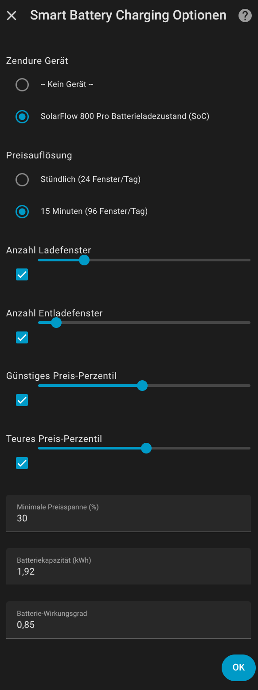

# Smart Battery Charging

[](https://github.com/mavnezz/smart_battery_charging/releases)
[](LICENSE)
[](https://github.com/hacs/integration)
[](https://github.com/mavnezz/smart_battery_charging/commits/main)
[](https://www.home-assistant.io/)

<!-- Uncomment when available:
[](YOUR_DISCORD_LINK)
[](YOUR_FORUM_LINK)
-->

Eine Home Assistant Integration zur **intelligenten, profitablen Steuerung** von Batteriespeichern basierend auf dynamischen Strompreisen von Tibber.

<!-- Place a banner/screenshot here when available:

-->

## Funktionen

- **Tibber-Anbindung**: Echtzeit- und Vorhersage-Strompreise via Tibber GraphQL API
- **Preisanalyse**: Identifiziert günstigste Ladefenster und teuerste Entladefenster
- **Profitabilitäts-Check**: Berücksichtigt Wirkungsgradverluste - handelt nur wenn es sich lohnt
- **Zendure Solarflow Support**: Steuert Zendure Solarflow 800 Pro via min_soc
- **Betriebsmodi**: Off, Auto, Laden, Entladen - flexibel einstellbar
- **Smart Meter Mode kompatibel**: Arbeitet mit Zendures Nulleinspeisung zusammen

## So funktioniert's

### Preisfenster-Berechnung

Die Integration analysiert alle Strompreise für heute und morgen:

1. **Günstigste Stunden** (z.B. untere 25%) → Ladefenster
2. **Teuerste Stunden** (z.B. obere 25%) → Entladefenster
3. **Dazwischen** → Idle (normale Nutzung)

### Profitabilitäts-Check

Vor jeder Aktion wird geprüft, ob sich das Laden/Entladen **wirtschaftlich lohnt**:

```
Erforderlicher Spread = max(Breakeven-Spread, Konfigurierter min_spread)

Breakeven-Spread = (1 / Wirkungsgrad - 1) × 100%
                 = (1 / 0.85 - 1) × 100% = 17,6%
```

**Beispiel mit Default-Einstellungen (30% min_spread, 85% Effizienz):**

| Situation | Spread | Aktion |
|-----------|--------|--------|
| Günstig: 25c → Teuer: 35c | 40% | Laden/Entladen |
| Günstig: 26c → Teuer: 31c | 19% | IDLE (lohnt sich nicht) |

### Batteriesteuerung via min_soc

Die Steuerung erfolgt über den `min_soc`-Wert des Zendure-Geräts:

| Modus | min_soc | Effekt |
|-------|---------|--------|
| **Laden** | 100% | Batterie lädt bis 100% |
| **Idle** | 50% | Normale Nutzung, Reserve halten |
| **Entladen** | 10% | Batterie kann fast vollständig entladen |

> **Hinweis:** Im Smart Meter Mode regelt Zendure weiterhin die Nulleinspeisung. Diese Integration steuert nur, wie viel Energie verfügbar gemacht wird.

## Betriebsmodi

| Modus | Beschreibung |
|-------|--------------|
| **Off** | Integration deaktiviert, Batterie auf Idle (50%) |
| **Auto** | Automatischer Wechsel basierend auf Strompreisen |
| **Charge** | Erzwingt Laden (min_soc=100%) |
| **Discharge** | Erzwingt Entladen (min_soc=10%) |

## Sensoren

| Sensor | Beschreibung |
|--------|--------------|
| **Current Price** | Aktueller Strompreis (€/kWh) |
| **Average Price** | Durchschnittspreis heute/morgen |
| **Price Spread** | Unterschied zwischen Min/Max Preis (%) |
| **Recommended State** | Empfohlener Zustand: charge, discharge, idle |
| **Cheapest Windows** | Anzahl und Zeiten der günstigsten Fenster |
| **Expensive Windows** | Anzahl und Zeiten der teuersten Fenster |
| **Next Cheap Window** | Nächstes günstiges Zeitfenster |
| **Next Expensive Window** | Nächstes teures Zeitfenster |
| **Potential Savings** | Geschätzte Ersparnis pro kWh |

### Zusätzliche Sensor-Attribute

- `is_profitable` - Ist die aktuelle Operation profitabel?
- `avg_charge_price` - Durchschnittlicher Ladepreis
- `avg_discharge_price` - Durchschnittlicher Entladepreis
- `required_spread` - Erforderlicher Mindest-Spread

## Installation

### HACS (Empfohlen)

1. HACS in Home Assistant öffnen
2. "Integrationen" auswählen
3. Drei-Punkte-Menü → "Benutzerdefinierte Repositories"
4. Repository-URL hinzufügen: `https://github.com/mavnezz/smart_battery_charging`
5. Kategorie: "Integration"
6. "Smart Battery Charging" suchen und installieren
7. Home Assistant neu starten

### Manuelle Installation

1. Den Ordner `custom_components/smart_battery_charging` in dein Home Assistant `config/custom_components/` Verzeichnis kopieren
2. Home Assistant neu starten

## Konfiguration

### Ersteinrichtung

1. **Einstellungen → Geräte & Dienste → Integration hinzufügen**
2. Nach "Smart Battery Charging" suchen
3. Tibber API Token eingeben (von https://developer.tibber.com/settings/access-token)
4. Bei mehreren Häusern das gewünschte auswählen

### Optionen

| Option | Default | Beschreibung |
|--------|---------|--------------|
| **Zendure Gerät** | - | Name des Zendure-Geräts (aus Entity-IDs) |
| **Preisauflösung** | Stündlich | Stündlich oder 15-Minuten |
| **Anzahl Ladefenster** | 6 | Max. Stunden für Laden |
| **Anzahl Entladefenster** | 3 | Max. Stunden für Entladen |
| **Günstiges Perzentil** | 25% | Welche Preise gelten als günstig |
| **Teures Perzentil** | 75% | Welche Preise gelten als teuer |
| **Min. Spread** | 30% | Mindest-Preisunterschied für Aktion |
| **Batterie-Kapazität** | 0.8 kWh | Nutzbare Kapazität |
| **Batterie-Wirkungsgrad** | 85% | Roundtrip-Effizienz |

### Zendure-Gerät finden

Der Gerätename entspricht dem Prefix deiner Zendure-Entities:

```
number.solarflow_800_pro_min_soc
       ^^^^^^^^^^^^^^^^
       Das ist der Gerätename
```

## Services

### smart_battery_charging.set_battery_state

Manuelles Setzen des Batterie-Zustands:

```yaml
service: smart_battery_charging.set_battery_state
data:
  state: charge  # charge, discharge, idle, off
  charge_power: 800  # optional, in Watt
  discharge_power: 800  # optional, in Watt
```

### smart_battery_charging.recalculate_windows

Neuberechnung der Preisfenster erzwingen:

```yaml
service: smart_battery_charging.recalculate_windows
```

## Voraussetzungen

- Home Assistant 2024.1 oder neuer
- Tibber-Konto mit API-Zugang
- Für Batteriesteuerung: [Zendure Home Assistant Integration](https://github.com/Zendure/Zendure-HA)

## FAQ

### Warum passiert nichts, obwohl es günstige Stunden gibt?

Der Profitabilitäts-Check hat festgestellt, dass der Preisunterschied zu gering ist. Prüfe:
- `is_profitable` Attribut am Sensor
- `required_spread` vs. aktueller Spread
- Eventuell `min_spread` in den Optionen reduzieren

### Wie finde ich mein Zendure-Gerät?

Suche in den Entwicklerwerkzeugen → Zustände nach `_min_soc`. Der Teil vor `_min_soc` ist dein Gerätename.

### Funktioniert das mit Smart Meter Mode?

Ja! Die Integration steuert nur den `min_soc`-Wert. Zendures Smart Meter Mode regelt weiterhin die Nulleinspeisung.

### Kann ich den Wirkungsgrad anpassen?

Ja, in den Integrationsoptionen. 85% ist ein guter Standardwert für Lithium-Batterien mit Wechselrichter.

## Dokumentation

📚 **Ausführliche Dokumentation:**
- [Konfiguration](docs/configuration.md) - Detaillierte Erklärung aller Optionen
- [Sensoren](docs/sensors.md) - Übersicht aller verfügbaren Sensoren und Attribute
- [Services](docs/services.md) - Service-Aufrufe und Automatisierungs-Beispiele
- [Changelog](CHANGELOG.md) - Vollständiger Änderungsverlauf

## Screenshots

### Integration Übersicht


Die Integration bietet alle wichtigen Sensoren und Steuerelemente auf einen Blick:
- 9 Sensoren für Preise, Fenster und Empfehlungen
- Betriebsmodus-Auswahl (Off/Auto/Charge/Discharge)
- Einfache Dashboard-Integration

### Konfiguration


Flexible Konfigurationsoptionen:
- Zendure Geräte-Auswahl
- Preisauflösung (stündlich / 15-Minuten)
- Anpassbare Lade-/Entladefenster
- Perzentil-basierte Preisanalyse
- Profitabilitäts-Schwellwert
- Batteriekapazität und Wirkungsgrad

## Support & Community

- 🐛 [Bug Reports](https://github.com/mavnezz/smart_battery_charging/issues/new?template=bug_report.yml)
- 💡 [Feature Requests](https://github.com/mavnezz/smart_battery_charging/issues/new?template=feature_request.yml)
- 💬 [Discussions](https://github.com/mavnezz/smart_battery_charging/discussions)
- 📖 [Home Assistant Community Forum](https://community.home-assistant.io/)

## Lizenz

MIT License - siehe [LICENSE](LICENSE) Datei.

## Mitwirken

Beiträge sind willkommen! Bitte lies die [Contributing Guidelines](CONTRIBUTING.md) für Details zum Entwicklungsprozess.

## Changelog

Siehe [CHANGELOG.md](CHANGELOG.md) für eine vollständige Liste aller Änderungen.

**Aktuelle Version: 0.3.0**
- Professionelles Repository-Setup mit GitHub Actions
- Umfangreiche Dokumentation (Configuration, Sensors, Services)
- DevContainer für einfaches Development
- Screenshots und verbessertes README

---

**Autor:** mavnezz
**Repository:** https://github.com/mavnezz/smart_battery_charging
